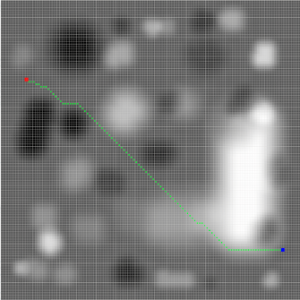
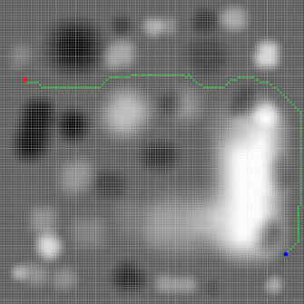
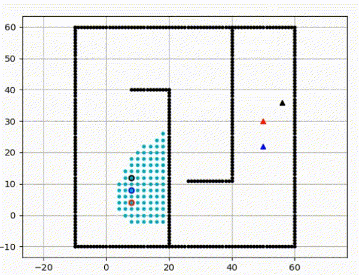
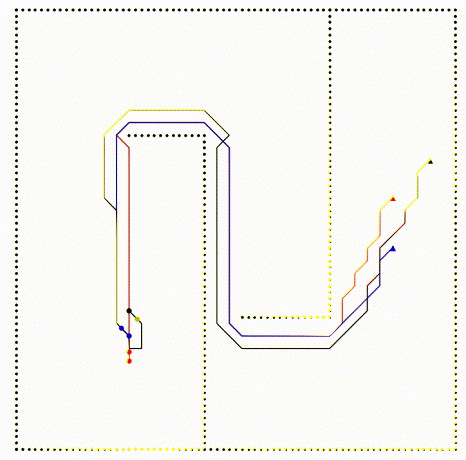
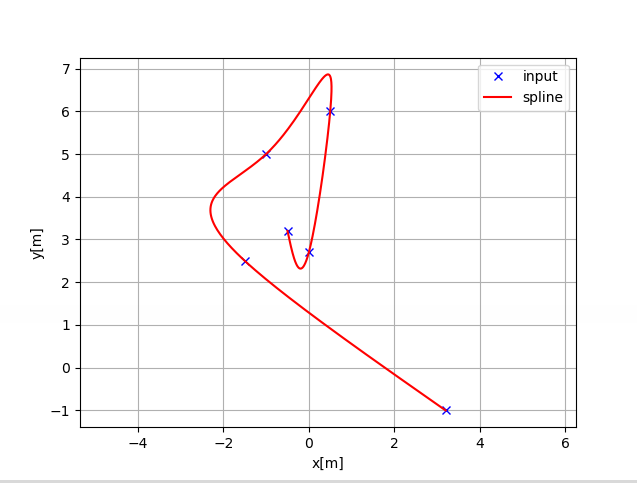

# Xuan Phat Truong

Robotics & AI Researcher | Control Systems Enthusiast

Department of Mechanical and Civil Engineer, Florida Institute of Technology

Email: phat.xuan.truong@gmail.com • [GitHub](https://github.com/phat-truongxuan) • [LinkedIn](https://www.linkedin.com/in/xuan-phat-truong-2545001a0/)

---
# Publication

**Truong, X. P., & Hong, S. H. (2024). Rough Terrain Path Planning for Autonomous Ground Robot. In AIAA SCITECH 2024 Forum (p. 2764).**
[ DOI](https://doi.org/10.2514/6.2024-2764)

**Truong, X. P., Jeon, H., Wang, Y., & Hong, S. H. (2025). Monitoring energy consumption for cyberattack detection in additive manufacturing systems. The International Journal of Advanced Manufacturing Technology, 1-17.**[ DOI](https://doi.org/10.1007/s00170-025-16551-2)

---
# Publication Demo

## 1. Rough Terrain Path Planning for Autonomous Ground Robot

**The system is setup on ROS and ROS2, planner map displayed on RViz, simulation built on Gazebo. The robot uses differential drive (4 wheeled drive) and tracks the planned path using PID controller**

**a. Without terrain planner**

| Planned Path | Path Tracking |
|:------:|:------:|
|  |  |

**b. With terrain planner**

| Planned Path | Path Tracking |
|:------:|:------:|
|  |  |

---
# Side Project

## Neural Network tuning using Genetic Algorithm

**This project uses PyGame as an environment. The goal is to tune a Neural Network (NN) weights using Genetic Algorithm (GA) so the car can adapt and cross the finish line. The input of the NN is the LiDAR distance values, and the output is the steering action. A generation is recreated with the best candidates after each episode termination and mutates to search for the best policy.**

---

## Nav2 demo with Gazebo

[Video](https://www.youtube.com/watch?v=vf5PCvhSXe0)

---

## Moveit demo with Gazebo

[Video](https://www.youtube.com/watch?v=X2w5IWsK_So&t=62s)

---

## AStar Path Planning with Multiple Agent (time scheduling) (with Python)

| Plan Path | Execute Path |
|:------:|:------:|
|  |  |

[Code](https://github.com/phat-truongxuan/path_algo.git)

## Cubic Spline Interpolation (with C++)

[Code](https://github.com/phat-truongxuan/path_algo.git)

---

## Delta Robot fully built and controlled

[Video](https://www.youtube.com/watch?v=rsFehdk5Mqs)
